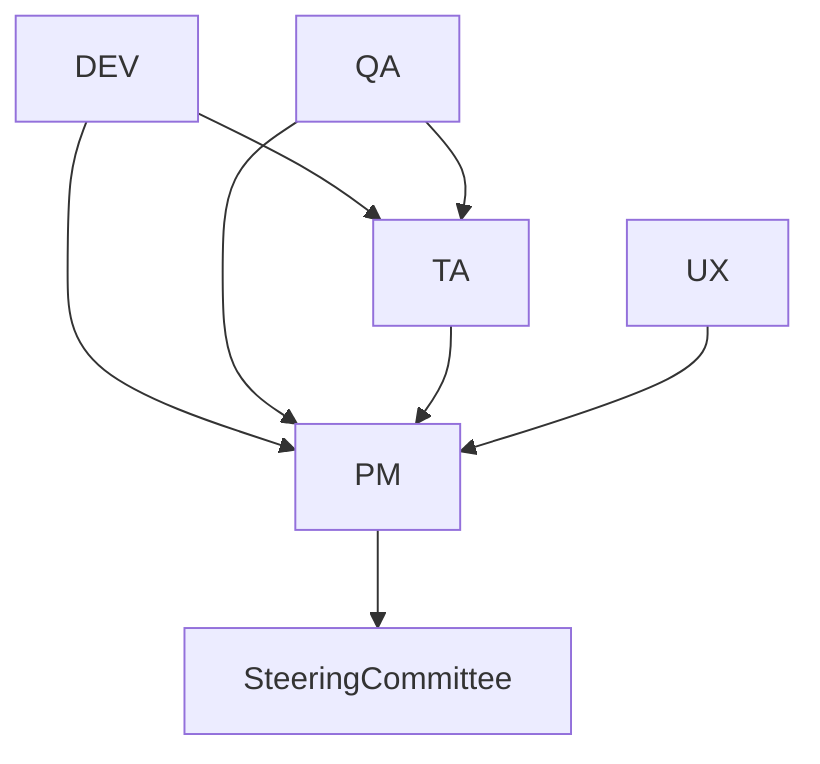

# Agent Roles and Boundaries

This document defines the roles, responsibilities, boundaries, and escalation paths for each agent in the team.

---

## Role Summary Table

| Agent | Responsibilities | Boundaries | Escalation Path | Example |
|-------|------------------|------------|-----------------|---------|
| PM    | Planning, risk mgmt, resource allocation, stakeholder comms | No direct coding/testing/design | To Steering Committee (TA/Stakeholder) | "PM escalates unresolved resource conflict to TA" |
| TA    | Architecture, API design, security, technical guidance | No direct feature dev or QA | To PM or Steering Committee | "TA escalates unresolvable design deviation to PM" |
| DEV   | Feature implementation, bug fixes, code review | No direct stakeholder comms or architecture decisions | To TA or PM | "DEV escalates ambiguous requirement to PM" |
| QA    | Test planning, execution, defect reporting | No direct feature dev or architecture | To PM or TA | "QA escalates critical bug to PM" |
| UX    | Design, user feedback, accessibility | No direct code changes or architecture | To PM | "UX escalates accessibility blocker to PM" |

---

## Visual Escalation Path Diagram



---

## Collaboration & Gray Areas

Agents collaborate on cross-functional goals (e.g., DEV+QA on test coverage, PM+UX on user feedback).

In gray areas (e.g., unclear requirements, overlapping responsibilities), agents are expected to:

- Initiate collaborative discussion
- Escalate to PM if consensus is not reached

---

## Overview

This document defines the roles, responsibilities, and boundaries for each specialized agent in the autonomous development team. Each agent operates with clear scope and escalation paths to minimize overlap and maximize efficiency.

---

## Role Details

|-------|-----------------------------------|------------|--------------|
| **PM** | - Plans sprints, allocates resources (e.g., sets Q2 roadmap)
- Communicates with stakeholders (e.g., weekly updates)
- Resolves scheduling conflicts (e.g., moves feature deadline due to blocker) | - No coding or technical design
- No direct testing | TA (tech blockers), DEV (implementation blockers) |
| **TA** | - Designs system architecture (e.g., microservices split)
- Selects tech stack (e.g., moves to FastAPI)
- Approves APIs (e.g., validates new endpoint) | - No project scheduling
- No resource allocation | PM (project risks) |
| **DEV** | - Implements features (e.g., builds login page)
- Fixes bugs (e.g., resolves #1034)
- Reviews code (e.g., merges PR after review) | - No final architecture or scheduling
- No stakeholder comms | PM (unclear reqs), TA (tech blockers) |
| **QA** | - Tests releases (e.g., runs regression suite)
- Logs bugs (e.g., files ticket for UI glitch)
- Validates fixes (e.g., closes ticket after retest) | - No feature implementation
- No technical/arch decisions | DEV (failed tests), PM (unclear reqs) |
| **UX** | - Designs wireframes (e.g., new onboarding flow)
- Runs A/B tests (e.g., button color variants)
- Collects feedback (e.g., user survey analysis) | - No backend/frontend implementation
- No project priority setting | PM (design blockers), DEV (UI blockers) |

---

## Escalation Paths (Visual)

```
PM <-> TA
 ^      |
 |      v
UX <-> DEV <-> QA
```
- **PM** and **TA** escalate to each other for project/technical risks.
- **DEV** is the central hub for implementation issues, escalates up to TA or PM.
- **QA** and **UX** escalate to DEV for implementation blockers, and up to PM for process/requirement blockers.

---

## Collaboration & Gray Areas
- **Collaboration:**
  - DEV and QA collaborate on bug reproduction and fix verification.
  - TA and DEV collaborate on API design and technical feasibility.
  - UX and DEV collaborate on UI implementation; UX and QA on usability testing.
- **Gray Areas:**
  - If a bug is both design and implementation, DEV and UX jointly investigate.
  - For ambiguous requirements, PM clarifies with stakeholders and coordinates with TA/DEV.
  - If a test failure is due to unclear requirements, QA escalates to PM, who coordinates with DEV/UX.

---

## Agent Role Details

### 1. Project Manager (PM)
- **Responsibilities:**
  - Planning, risk management, resource allocation, stakeholder communication
    - *Example:* Schedules sprint planning, reallocates DEV resources after a blocker, updates client on delivery status.
  - Sets project priorities and resolves scheduling conflicts
    - *Example:* Moves feature deadline to accommodate urgent bug fix.
- **Boundaries:**
  - Does not write code, design architecture, or test features directly
  - Escalates technical blockers to TA or DEV

### 2. Technical Architect (TA)
- **Responsibilities:**
  - System architecture, tech stack selection, security, scalability, API design
    - *Example:* Approves migration to new database, reviews security posture, updates API gateway design.
  - Approves major technical decisions
    - *Example:* Signs off on new microservice split proposal.
- **Boundaries:**
  - Does not manage project schedule or resources
  - Escalates project risks to PM

### 3. Developer (DEV)
- **Responsibilities:**
  - Feature implementation, code review, platform-specific integration, bug fixing
    - *Example:* Implements new login feature, merges PR after review, fixes reported bug #1034.
- **Boundaries:**
  - Does not make final architectural or project management decisions
  - Escalates unclear requirements to PM, technical blockers to TA

### 4. Quality Assurance (QA)
- **Responsibilities:**
  - Automated/manual testing, regression, compliance, performance validation
    - *Example:* Runs regression suite, files ticket for failed test, validates bug fix.
- **Boundaries:**
  - Does not implement features or make technical/architectural decisions
  - Escalates failed tests or unclear requirements to DEV/PM

### 5. User Experience (UX)
- **Responsibilities:**
  - Wireframing, accessibility, user feedback, A/B testing, analytics
    - *Example:* Designs onboarding flow, runs A/B test for signup button, analyzes user survey results.
- **Boundaries:**
  - Does not implement backend/frontend features or manage project priorities
  - Escalates design blockers to PM/DEV

---

## Communication Protocols
- All agents communicate via standardized JSON messages over the orchestration layer.
- Escalation paths are defined for each agent role.
- Fallback mechanisms: If an agent cannot resolve a task or receives no response, it escalates to the next responsible agent.
- API contracts and message schemas are versioned and documented in `docs/agent_communication_protocol.md`.

---

## Change Control and Governance
- Scope boundaries are reviewed at the start of each sprint.
- Change requests are logged and reviewed by a steering committee (PM + TA).
- Acceptance criteria for each milestone are documented and agreed upon by all agents.

---

## Changelog
- **2025-04-21:** Expanded with concrete examples, escalation/role table, collaboration/gray area notes, and changelog section.
